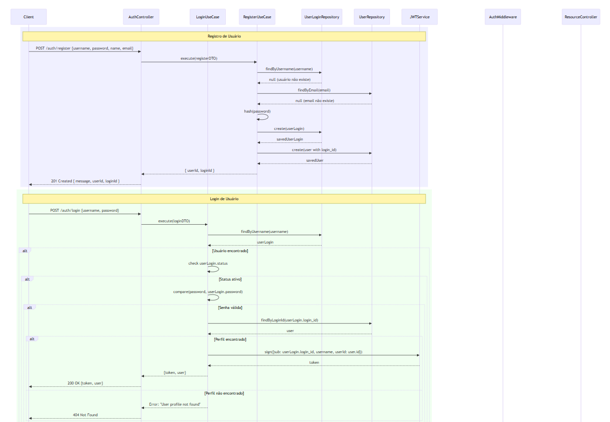
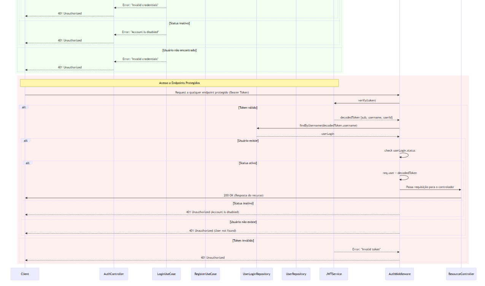
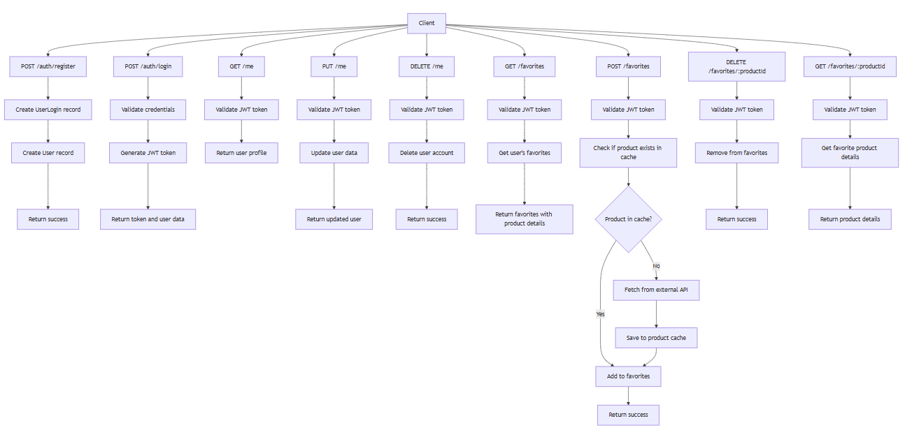
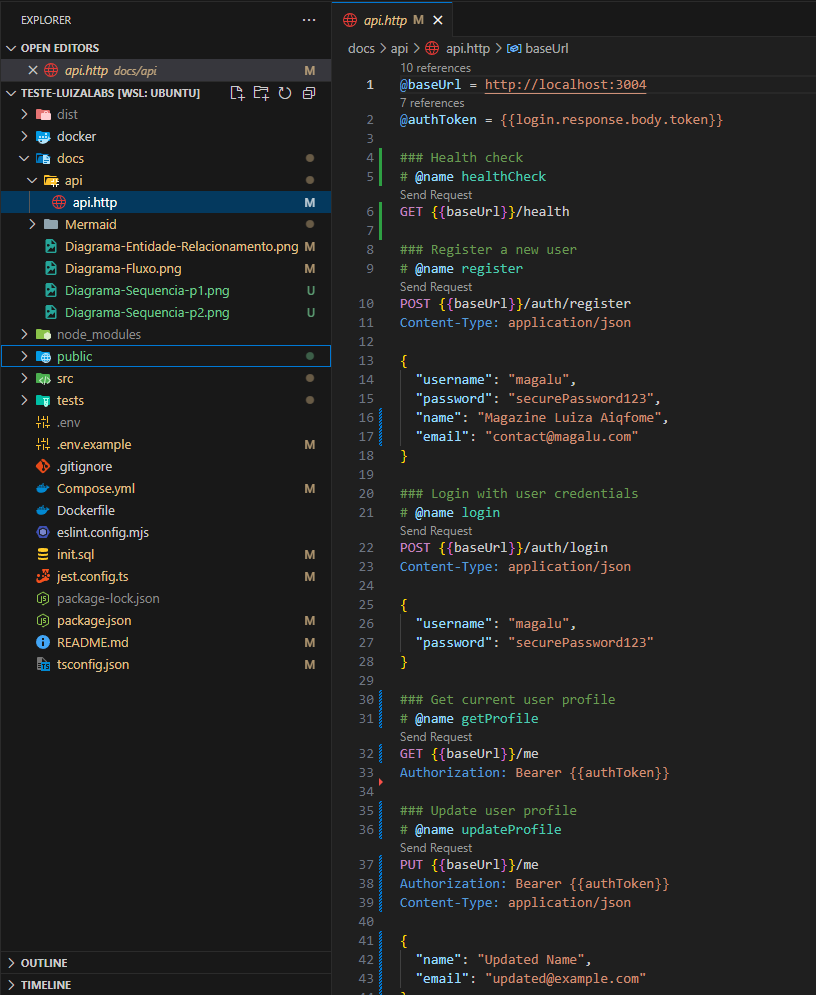

# Luiza Labs Test Project - Favorite Products API

<div align="center">
  
</div>
<div align="center">
  
</div>

---

## Language - Idioma

- 🇺🇸 [English Version](#-english-version)
- 🇧🇷 [Versão em Português](#-versão-em-português)

---

## 🇺🇸 English Version

### Overview

This project is a test assignment for a position at **Luiza Labs (Aiqfome)**.  
The goal is to demonstrate my ability to develop a **scalable and maintainable backend application** that:

- Manages favorite products from an external API
- Stores them in a relational database
- Provides **REST endpoints** to access this information

---

### Key Features

- **User Authentication** → Secure registration & login with **JWT tokens**
- **RESTful API** → Endpoints for user management and favorite product operations (add, remove, list)
- **Data Management** → Relational model with proper relationships between users and favorite products
- **External API Integration** → Fetches product data from an external API and maintains a local cache

---

### Objectives

- Follow **Clean Architecture** & Domain-Driven Design
- Secure endpoints with **JWT**
- Provide **comprehensive tests**

---

### 🛠️ Technologies Used

- Node.js 20.x
- TypeScript 5.x
- Fastify 4.x
- TypeORM 0.3.x
- PostgreSQL 15.x
- Jest 30.x
- Docker 24.x + Docker Compose 3.x
- Mermaid (for diagrams)

---

### Sequence Diagram

  


To provide a better understanding of the authentication process, a sequence diagram was created using Mermaid. This diagram illustrates the interaction between different components of the system during authentication:

- **Registration Process:** Shows the flow when a new user registers in the system.
- **Login Process: Demonstrates** how user credentials are validated and tokens are generated.
- **Protected Endpoints Access:** Illustrates how JWT tokens are verified when accessing protected resources.

**Authentication Flow Includes:**

- Registration Process
- Login Process
- Protected Endpoints Access

---

### Flow Diagram



This flow diagram illustrates the key operational processes in the system:

- **Authentication Flow:** Shows the complete flow for user registration and login.
- **User Management Flow:** Illustrates how user profile data is managed.
- **Favorites Management Flow:** Demonstrates how favorite products are added, removed, and retrieved.

**Flow Includes:**

- Authentication Flow
- User Management Flow
- Favorites Management Flow

---

### Database Diagram


The database follows a relational model with the following main entities:

**Main Entities:**

- **UserLogins** → manages authentication credentials
- **Users** → stores profile information
- **FavoriteProducts** → tracks user favorites
- **ProductCache** → stores external API product data

---

## Installation

To install the project, follow these steps:

1. Copy the `.env-example` file to `.env` and configure it with your environment-specific settings:
   ```bash
   cp .env-example .env
   ```
2. Edit the .env file to set the following variables:

   ```env
      PORT=
      NODE_ENV="development" # or "production" or "test"
      DB_HOST=db
      DB_PORT=5432
      DB_USERNAME=
      DB_PASSWORD=
      DB_NAME=luizalabsaiqdb
      JWT_SECRET=secret_key

      #Test configuration
      TEST_TYPE=unit  # or integration
   ```

3. Start the services using Docker Compose
   ```bash
    docker-compose up -d --build
   ```
4. Run the tests:
   - After starting the services, you can run the tests to ensure everything is working correctly. To do this, use the test service defined in the `docker-compose.yml`:

   ```bash
      docker-compose run --rm test
   ```

   - This command will execute the `test` service, which has been configured to run the tests defined in your project. The `--rm` flag removes the test container after execution to keep the environment clean.

### Additional Installation and Maintenance Options

To perform optional cleanup and avoid potential conflicts, you can run the following scripts:

- **Linux**:
  1.  **Clean up local directories and Docker cache**:
      - Run the following script to remove `node_modules` and `dist` directories and optionally clean Docker cache:
      ```bash
      chmod +x ./docker/docker-run.sh && ./docker/docker-run.sh
      ```
      The script performs the following steps:
      - Removes `node_modules` and `dist` directories if they exist.
      - Prompts for confirmation to clean Docker cache using docker `system prune -f`.
      - Provides options for cleaning Docker images and volumes if needed.
      - 
- **Windows**:
  - You can use the provided `.bat` and `.ps1` scripts to clean and rebuild your Docker environment:
  1.  **Run the clean and build batch script**:
      ```batch
      .\docker\docker-run.bat
      ```
  2.  **Or, run the PowerShell script**:
      ```powershell
      .\docker\docker-run.ps1
      ```
  - These scripts will:
    - Remove local `node_modules` and `dist` directories if they exist.
    - Optionally, clean Docker caches and remove volumes.

## Usage

- **Swagger API Documentation**: The Swagger API documentation can be accessed at http://localhost:3004/docs/. This provides detailed information about the API endpoints and how to use them.


You can view the Swagger API documentation [here](http://localhost:3004/docs/).

- **Adminer**: Adminer is available for internal database management at http://localhost:8091. This tool allows you to manage and interact with the database directly.


You can access Adminer for internal database management [here](http://localhost:8091/).

- **API Testing with api.http**: You can view and test the API using the api.http file included in the project. This file contains predefined API requests that can be executed using the [REST Client](https://marketplace.visualstudio.com/items?itemName=humao.rest-client) extension in VSCode. Make sure to install the [REST Client](https://marketplace.visualstudio.com/items?itemName=humao.rest-client) extension to enable this functionality.



## 🇧🇷 Versão em Português

### Visão Geral

Este projeto é um teste para uma vaga na **Luiza Labs (Aiqfome)**.
O objetivo é demonstrar minha capacidade de desenvolver uma **aplicação backend escalável e de fácil manutenção** que:

- Gerencie produtos favoritos de uma API externa
- Armazene-os em um banco relacional
- Forneça **endpoints REST** para acesso às informações

---

### Principais Funcionalidades

- **Autenticação de Usuários** → Registro e login seguro com **JWT**
- **API RESTful** → Endpoints para gerenciamento de usuários e favoritos (adicionar, remover, listar)
- **Gerenciamento de Dados** → Modelo relacional entre usuários e produtos favoritos
- **Integração Externa** → Busca e cache de produtos da API externa

---

### Objetivos

- Seguir princípios de **Arquitetura Limpa** e **DDD**
- Proteger endpoints com **JWT**
- Incluir **testes abrangentes**

---

### Tecnologias Utilizadas

- Node.js 20.x
- TypeScript 5.x
- Fastify 4.x
- TypeORM 0.3.x
- PostgreSQL 15.x
- Jest 30.x
- Docker 24.x + Docker Compose 3.x
- Mermaid (para diagramas)

---

### Diagrama de Sequência


Para fornecer uma melhor compreensão do processo de autenticação, foi criado um diagrama de sequência usando Mermaid. Esse diagrama ilustra a interação entre os diferentes componentes do sistema durante a autenticação:

- **Processo de Registro:** Mostra o fluxo quando um novo usuário se registra no sistema.
- **Processo de Login:** Demonstra como as credenciais do usuário são validadas e os tokens são gerados.
- **Acesso a Endpoints Protegidos:** Ilustra como os tokens JWT são verificados ao acessar recursos protegidos.

---

### Diagrama de Fluxo


Este diagrama de fluxo ilustra os principais processos operacionais no sistema:

- **Fluxo de Autenticação:** Mostra o fluxo completo para registro e login de usuários.
- **Fluxo de Gerenciamento de Usuários:** Ilustra como os dados de perfil do usuário são gerenciados.
- **Fluxo de Gerenciamento de Favoritos:** Demonstra como os produtos favoritos são adicionados, removidos e recuperados.

---

### Diagrama do Banco de Dados


O banco de dados segue um modelo relacional com as seguintes entidades principais:

- **UserLogins** → gerencia credenciais de autenticação
- **Users** → armazena informações de perfil
- **FavoriteProducts** → rastreia os produtos favoritos dos usuários
- **ProductCache** → armazena dados de produtos da API externa

---

## Instalação

Para instalar o projeto, siga estas etapas:

1. Copie o arquivo `.env-example` para `.env` e configure-o com suas configurações específicas do ambiente:
   ```bash
   cp .env-example .env
   ```
2. Edite o arquivo .env para definir as seguintes variáveis:

   ```env
      PORT=
      NODE_ENV="development" # or "production" or "test"
      DB_HOST=db
      DB_PORT=5432
      DB_USERNAME=
      DB_PASSWORD=
      DB_NAME=luizalabsaiqdb
      JWT_SECRET=secret_key

      #Test configuration
      TEST_TYPE=unit  # or integration
   ```

3. Inicie os serviços usando o Docker Compose:
   ```bash
     docker-compose up -d --build
   ```
4. Execute os testes:
   - Após iniciar os serviços, você pode rodar os testes para garantir que tudo esteja funcionando corretamente. Para isso, use o serviço de testes definido no `docker-compose.yml`:

   ```bash
      docker-compose run --rm test
   ```

   - Este comando executará o serviço `test`, que foi configurado para rodar os testes definidos no seu projeto. O `--rm` remove o contêiner de teste após a execução para manter o ambiente limpo.

### Opções Adicionais de Instalação e Manutenção

Para realizar limpeza opcional e evitar possíveis conflitos, você pode executar os seguintes scripts:

- **Linux**:
  1.  **Limpar diretórios locais e cache do Docker**:
      - Execute o seguinte script para remover os diretórios `node_modules` e `dist` e, opcionalmente, limpar o cache do Docker::
      ```bash
      chmod +x ./docker/docker-run.sh && ./docker/docker-run.sh
      ```
      O script realiza as seguintes etapas:
      - Remove os diretórios `node_modules` e `dist`, se existirem.
      - Solicita confirmação para limpar o cache do Docker usando `docker system prune -f`.
      - Oferece opções para limpar imagens e volumes do Docker, se necessário.
      - 
- **Windows**:
  - Você pode usar os scripts `.bat` e `.ps1` fornecidos para limpar e reconstruir seu ambiente Docker:
  1.  **Execute o script de limpeza e construção em batch**:
      ```batch
      .\docker\docker-run.bat
      ```
  2.  **Ou, execute o script PowerShell**:
      ```powershell
      .\docker\docker-run.ps1
      ```
  - Esses scripts irão:
    - Remover os diretórios locais `node_modules` e `dist`, se existirem.
    - Opcionalmente, limpar caches do Docker e remover volumes.

## Uso

- **Documentação da API Swagger**: A documentação da API Swagger pode ser acessada em http://localhost:3004/docs/. Isso fornece informações detalhadas sobre os endpoints da API e como usá-los.


Você pode visualizar a documentação da API Swagger [aqui](http://localhost:3004/docs/). (infelizmente não foi traduzido).

- **Adminer**: O Adminer está disponível para gerenciamento interno do banco de dados em http://localhost:8091. Esta ferramenta permite que você gerencie e interaja com o banco de dados diretamente.


Você pode acessar o Adminer para gerenciamento interno do banco de dados [aqui](http://localhost:8091/).

- **Teste de API com api.http**: Você pode visualizar e testar a API usando o arquivo api.http incluído no projeto. Este arquivo contém requisições de API pré-definidas que podem ser executadas usando a extensão [REST Client](https://marketplace.visualstudio.com/items?itemName=humao.rest-client) no VSCode. Certifique-se de instalar a extensão [REST Client](https://marketplace.visualstudio.com/items?itemName=humao.rest-client) para habilitar essa funcionalidade.


