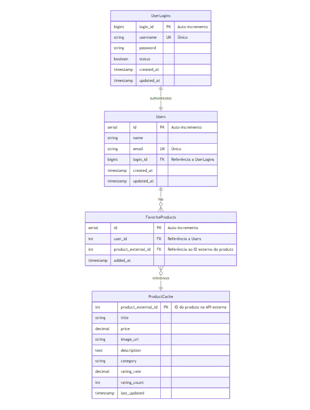
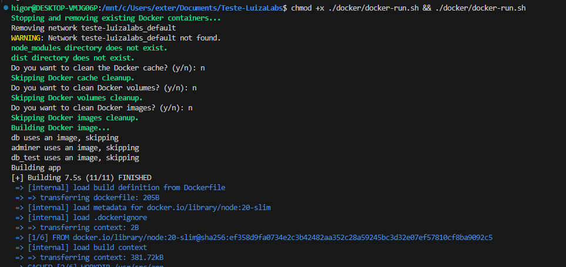
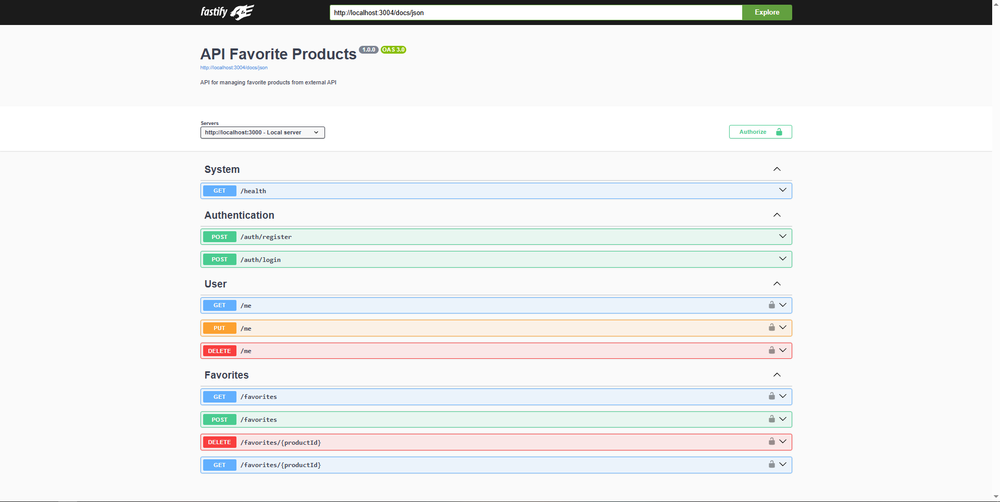

# Luiza Labs Test Project

<div align="center">
   
</div>

---

## Language - Idioma

- [English Version](#overview)
- [Versão em Português](#visão-geral)

---

## 🇺🇸 - English Version

---

## Overview

This project is a test assignment for a position at Luiza Labs. The goal is to demonstrate my ability to develop a scalable and maintainable backend application that processes order data from files, stores it in a database, and provides APIs to access this information.

### Key Features

- **File Processing**: The system processes fixed-width text files containing order data, extracts information about users, orders, and products, and stores it in a structured way.

- **RESTful API**: Provides endpoints for user authentication, file uploads, and order querying with various filters.

- **Data Management**: Implements a relational database model with proper relationships between users, orders, and products.

### Objectives

- **Follow Clean Architecture Principles**: The project is structured using domain-driven design with clear separation of concerns between domain logic, application services, and infrastructure.

- **Implement Security with JWT**: JWT authentication is used to secure the API endpoints.

- **Provide Comprehensive Testing**: The project includes both tests to ensure functionality and reliability.

---

## Technologies Used

- **Node.js**: A JavaScript runtime built on Chrome's V8 JavaScript engine.
- **TypeScript**: A typed superset of JavaScript that compiles to plain JavaScript.
- **Fastify**: A high-performance web framework for Node.js.
- **TypeORM**: An ORM framework for TypeScript and JavaScript.
- **PostgreSQL**: A powerful, open-source object-relational database system.
- **Jest**: A testing framework for JavaScript, used for running unit and integration tests.
- **Docker**: A platform for developing, shipping, and running applications inside containers.
- **Docker Compose**: A tool for defining and running multi-container Docker applications.
- **Mermaid**: Used for database documentation and diagram generation.

## Versions Used

- **Node.js**: 20.x
- **TypeScript**: 5.x
- **Fastify**: 4.x
- **TypeORM**: 0.3.x
- **PostgreSQL**: 15.x
- **Jest**: 30.x
- **Docker**: 24.x
- **Docker Compose**: 3.x

---

## Database Diagram



The database follows a relational model with the following main entities:

- **Users**: Stores information about users who place orders
- **Orders**: Contains order details with relations to users and products
- **Products**: Stores product information associated with orders
- **UserLogin**: Manages authentication and user access
- **Upload**: Tracks file uploads and processing results

Each entity uses both internal auto-incremented IDs for relationships and business IDs for external references.

The database documentation and diagrams were created using Mermaid for better visualization and understanding of the data structure.

---

## Installation

To install the project, follow these steps:

1. Copy the `.env-example` file to `.env` and configure it with your environment-specific settings:
   ```bash
   cp .env-example .env
   ```
2. Edit the .env file to set the following variables:

   ```env
    PORT=
    NODE_ENV="development" # or "production" or "test"
    DB_HOST=db
    DB_PORT=5432
    DB_USERNAME=
    DB_PASSWORD=
    DB_NAME=
    JWT_SECRET=secret_key

    # Upload limits
    UPLOAD_FILE_SIZE_LIMIT=5242880  # 5MB em bytes
    UPLOAD_MAX_FILES=10
    UPLOAD_FIELD_SIZE=100

    #Test configuration
    TEST_TYPE=unit  # or integration
   ```

3. Start the services using Docker Compose
   ```bash
    docker-compose up -d --build
   ```
4. Run the tests:
   - After starting the services, you can run the tests to ensure everything is working correctly. To do this, use the test service defined in the `docker-compose.yml`:

   ```bash
      docker-compose run --rm test
   ```

   - This command will execute the `test` service, which has been configured to run the tests defined in your project. The `--rm` flag removes the test container after execution to keep the environment clean.

### Additional Installation and Maintenance Options

To perform optional cleanup and avoid potential conflicts, you can run the following scripts:

- **Linux**:
  1.  **Clean up local directories and Docker cache**:
      - Run the following script to remove `node_modules` and `dist` directories and optionally clean Docker cache:
      ```bash
      chmod +x ./docker/docker-run.sh && ./docker/docker-run.sh
      ```
      The script performs the following steps:
      - Removes `node_modules` and `dist` directories if they exist.
      - Prompts for confirmation to clean Docker cache using docker `system prune -f`.
      - Provides options for cleaning Docker images and volumes if needed.
      - 
- **Windows**:
  - You can use the provided `.bat` and `.ps1` scripts to clean and rebuild your Docker environment:
  1.  **Run the clean and build batch script**:
      ```batch
      .\docker\docker-run.bat
      ```
  2.  **Or, run the PowerShell script**:
      ```powershell
      .\docker\docker-run.ps1
      ```
  - These scripts will:
    - Remove local `node_modules` and `dist` directories if they exist.
    - Optionally, clean Docker caches and remove volumes.

## Usage

- **Swagger API Documentation**: The Swagger API documentation can be accessed at http://localhost:3004/docs/. This provides detailed information about the API endpoints and how to use them.


You can view the Swagger API documentation [here](http://localhost:3004/docs/).

- **Adminer**: Adminer is available for internal database management at http://localhost:8089. This tool allows you to manage and interact with the database directly.


You can access Adminer for internal database management [here](http://localhost:8091/).

- **API Testing with api.http**: You can view and test the API using the api.http file included in the project. This file contains predefined API requests that can be executed using the [REST Client](https://marketplace.visualstudio.com/items?itemName=humao.rest-client) extension in VSCode. Make sure to install the [REST Client](https://marketplace.visualstudio.com/items?itemName=humao.rest-client) extension to enable this functionality.

## 🇧🇷 - Versão em Português

## Visão Geral

Este projeto é um teste para uma vaga na Luiza Labs. O objetivo é demonstrar minha capacidade de desenvolver uma aplicação backend escalável e de fácil manutenção que processa dados de pedidos a partir de arquivos, armazena-os em um banco de dados e fornece APIs para acessar essas informações.

### Principais Funcionalidades

- **Processamento de Arquivos**: O sistema processa arquivos de texto de largura fixa contendo dados de pedidos, extrai informações sobre usuários, pedidos e produtos, e os armazena de forma estruturada.

- **API RESTful**: Fornece endpoints para autenticação de usuários, upload de arquivos e consulta de pedidos com vários filtros.

- **Gerenciamento de Dados**: Implementa um modelo de banco de dados relacional com relacionamentos adequados entre usuários, pedidos e produtos.

### Objetivos

- **Seguir Princípios de Arquitetura Limpa**: O projeto é estruturado usando design orientado a domínio com clara separação de responsabilidades entre lógica de domínio, serviços de aplicação e infraestrutura.

- **Implementar Segurança com JWT**: A autenticação JWT é usada para proteger os endpoints da API.

- **Fornecer Testes Abrangentes**: O projeto inclui testes para garantir funcionalidade e confiabilidade.

---

## Tecnologias Utilizadas

- **Node.js**: Um runtime JavaScript construído no motor V8 do Chrome.
- **TypeScript**: Um superconjunto tipado de JavaScript que compila para JavaScript puro.
- **Fastify**: Um framework web de alto desempenho para Node.js.
- **TypeORM**: Um framework ORM para TypeScript e JavaScript.
- **PostgreSQL**: Um poderoso sistema de banco de dados objeto-relacional de código aberto.
- **Jest**: Um framework de testes para JavaScript, usado para executar testes unitários e de integração.
- **Docker**: Uma plataforma para desenvolver, enviar e executar aplicações dentro de contêineres.
- **Docker Compose**: Uma ferramenta para definir e executar aplicações Docker de múltiplos contêineres.
- **Mermaid**: Utilizado para documentação do banco de dados e geração de diagramas.

## Versões Utilizadas

- **Node.js**: 20.x
- **TypeScript**: 5.x
- **Fastify**: 4.x
- **TypeORM**: 0.3.x
- **PostgreSQL**: 15.x
- **Jest**: 30.x
- **Docker**: 24.x
- **Docker Compose**: 3.x

---

## Diagrama do Banco de Dados


O banco de dados segue um modelo relacional com as seguintes entidades principais:

- **Users**: Armazena informações sobre usuários que fazem pedidos
- **Orders**: Contém detalhes dos pedidos com relações para usuários e produtos
- **Products**: Armazena informações de produtos associados a pedidos
- **UserLogin**: Gerencia autenticação e acesso de usuários
- **Upload**: Rastreia uploads de arquivos e resultados de processamento

Cada entidade usa IDs internos autoincrementados para relacionamentos e IDs de negócio para referências externas.

A documentação e os diagramas do banco de dados foram criados usando Mermaid para melhor visualização e compreensão da estrutura de dados.

---

## Instalação

Para instalar o projeto, siga estas etapas:

1. Copie o arquivo `.env-example` para `.env` e configure-o com suas configurações específicas do ambiente:
   ```bash
   cp .env-example .env
   ```
2. Edite o arquivo .env para definir as seguintes variáveis:

   ```env
    PORT=
    NODE_ENV="development" # or "production" or "test"
    DB_HOST=db
    DB_PORT=5432
    DB_USERNAME=
    DB_PASSWORD=
    DB_NAME=
    JWT_SECRET=secret_key

    # Upload limits
    UPLOAD_FILE_SIZE_LIMIT=5242880  # 5MB em bytes
    UPLOAD_MAX_FILES=10
    UPLOAD_FIELD_SIZE=100

    #Test configuration
    TEST_TYPE=unit  # or integration
   ```

3. Inicie os serviços usando o Docker Compose:
   ```bash
     docker-compose up -d --build
   ```
4. Execute os testes:
   - Após iniciar os serviços, você pode rodar os testes para garantir que tudo esteja funcionando corretamente. Para isso, use o serviço de testes definido no `docker-compose.yml`:

   ```bash
      docker-compose run --rm test
   ```

   - Este comando executará o serviço `test`, que foi configurado para rodar os testes definidos no seu projeto. O `--rm` remove o contêiner de teste após a execução para manter o ambiente limpo.

### Opções Adicionais de Instalação e Manutenção

Para realizar limpeza opcional e evitar possíveis conflitos, você pode executar os seguintes scripts:

- **Linux**:
  1.  **Limpar diretórios locais e cache do Docker**:
      - Execute o seguinte script para remover os diretórios `node_modules` e `dist` e, opcionalmente, limpar o cache do Docker::
      ```bash
      chmod +x ./docker/docker-run.sh && ./docker/docker-run.sh
      ```
      O script realiza as seguintes etapas:
      - Remove os diretórios `node_modules` e `dist`, se existirem.
      - Solicita confirmação para limpar o cache do Docker usando `docker system prune -f`.
      - Oferece opções para limpar imagens e volumes do Docker, se necessário.
      - 
- **Windows**:
  - Você pode usar os scripts `.bat` e `.ps1` fornecidos para limpar e reconstruir seu ambiente Docker:
  1.  **Execute o script de limpeza e construção em batch**:
      ```batch
      .\docker\docker-run.bat
      ```
  2.  **Ou, execute o script PowerShell**:
      ```powershell
      .\docker\docker-run.ps1
      ```
  - Esses scripts irão:
    - Remover os diretórios locais `node_modules` e `dist`, se existirem.
    - Opcionalmente, limpar caches do Docker e remover volumes.

## Uso

- **Documentação da API Swagger**: A documentação da API Swagger pode ser acessada em http://localhost:3004/docs/. Isso fornece informações detalhadas sobre os endpoints da API e como usá-los.


Você pode visualizar a documentação da API Swagger[here](http://localhost:3000/docs/). (infelizmente não foi traduzido).

- **Adminer**: O Adminer está disponível para gerenciamento interno do banco de dados em http://localhost:8089. Esta ferramenta permite que você gerencie e interaja com o banco de dados diretamente.


Você pode acessar o Adminer para gerenciamento interno do banco de dados [aqui](http://localhost:8091/).

- **Teste de API com api.http**: Você pode visualizar e testar a API usando o arquivo api.http incluído no projeto. Este arquivo contém requisições de API pré-definidas que podem ser executadas usando a extensão [REST Client](https://marketplace.visualstudio.com/items?itemName=humao.rest-client) no VSCode. Certifique-se de instalar a extensão [REST Client](https://marketplace.visualstudio.com/items?itemName=humao.rest-client) para habilitar essa funcionalidade.
